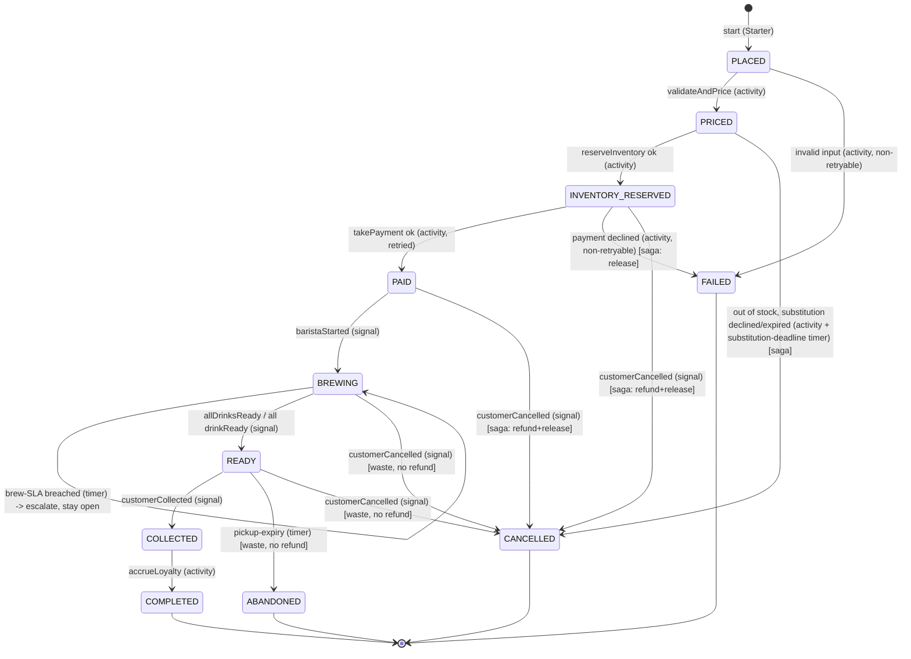

# OrderWorkflow — state diagram

Each transition is labelled with what drives it: **(activity)** result, **(signal)** from
outside, or **(timer)**. Compensations run via `io.temporal.workflow.Saga`.

